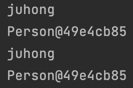
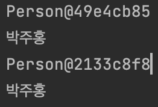
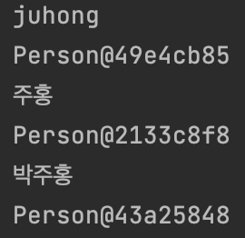

# # 깊은 복사 VS 얕은 복사

## 얕은 복사

```java
public class Person {
    String name;
    int age;

    public Person(String name, int age) {
        this.name = name;
        this.age = grade;
    }

    public String getName() {
        return name;
    }

    public void setName(String name) {
        this.name = name;
    }

    public int getAge() {
        return age;
    }

    public void setAge(int age) {
        this.age = age;
    }
}
```

```java
public static void main(String[] args) {
        Person person = new Person("주홍", 18);
        Person copyPerson = person;

        copyPerson.setName("juhong");

        System.out.println(person.getName());
        System.out.println(person);
        System.out.println(copyPerson.getName());
        System.out.println(copyPerson);
}
```

위의 코드를 보면 우리가 의도했던 것은 `copyPerson`의 값만 변경하고 싶다는 것을 알 수 있다.



그러나 정작 값은 위처럼 나오게 된다. `copyPerson = person`은 값을 대입하는게 아니라 주소를 대입하는 것이기 때문이다

이처럼 얕은 복사란(Shallow Copy)는 실제 값이 아닌, `주소`를 복사해서 같은 객체를 가리키는 것을 의미한다.

## 깊은 복사

> 아까 얕은 복사의 상황을 방지할 수 있는 것이 깊은 복사이다.

깊은 복사는 주로 Cleanable 인터페이스 구현, 복사 생성자, 복사 팩토리등을 이용해서 사용한다.

### Clonable 인터페이스 구현

Clonable 인터페이스의 clone() 메서드를 구현해서 깊은 복사를 진행하는 방식이다.

```java
public class Person implements Cloneable {

    String name;
    int age;

    public Person(String name, int age) {
        this.name = name;
        this.age = age;
    }

    public String getName() {
        return name;
    }

    public void setName(String name) {
        this.name = name;
    }

    public int getAge() {
        return age;
    }

    public void setAge(int age) {
        this.age = age;
    }

    @Override
    protected Person clone() throws CloneNotSupportedException {
        return (Person) super.clone();
    }
}
```

```java
public static void main(String[] args) throws CloneNotSupportedException {
    Person person = new Person("박주홍", 16);
    Person copyPerson = person.clone();
}
```



clone 메서드가 선언된 곳이 Cloneable이 아닌 Object이고, 그 마저도 protected이다. 그래서 Cloneable을 구현하는 것만으로는 외부 객체에서 clone 메소드를 호출할 수 없다. 

Cloneable이 몰고 온 모든 문제를 되짚어봤을 때, 새로운 인터페이스를 만들 때는 절대 Cloneable을 확장해서는 안 되며, 새로운 클래스도 이를 구현해서는 안된다. final 클래스라면 Cloneable을 구현해도 위험이 크지는 않지만 성능 관점에서 꺼려진다.

> 기본 원칙은 '복제 기능은 생성자와 팩터리를 이용하는게 최고' 라는 것이다. 그러나 배열만은 clone 메소드 방식이 가장 깔끔하다.

### 복사 생성자, 복사 팩터리

```java
public class Person {

    String name;
    int age;

    public Person() {
    }

    /*복사 생성자*/
    public Person(Person original) {
        this.name = original.getName();
        this.age = original.getAge();
    }

    /*복사 팩터리*/
    public static Person copy(Person original) {
        Person copyObject = new Person();
        copyObject.name = original.getName();
        copyObject.age = original.getAge();
        return copyObject;
    }
    
    public Person(String name, int age) {
        this.name = name;
        this.age = age;
    }

    public String getName() {
        return name;
    }

    public void setName(String name) {
        this.name = name;
    }

    public int getAge() {
        return age;
    }

    public void setAge(int age) {
        this.age = age;
    }
}
```

위처럼 복사 생성자와 복사 팩터리 메서드를 클래스에 추가한다.

```java
public static void main(String[] args) {
    Person person = new Person("juhong", 18);
    Person copyPersonUsingConstructor = new Person(person);
    Person copyPersonUsingFactory = Person.copy(person);

    copyPersonUsingConstructor.setName("주홍");
    copyPersonUsingFactory.setName("박주홍");

    System.out.println(person.getName());
    System.out.println(person);
    System.out.println(copyPersonUsingConstructor.getName());
    System.out.println(copyPersonUsingConstructor);
    System.out.println(copyPersonUsingFactory.getName());
    System.out.println(copyPersonUsingFactory);
}
```

위의 코드를 실행한 결과이다.



원본인 person을 복사 생성자를 이용해 깊은 복사한 copyPersonUsingConstructor의 값은 `주홍`으로, 복사 팩터리 메서드를 이용해 깊은 복사한 copyPersonUsingFactory의 값은 `박주홍`으로 바뀐다. 원본인 person은 그대로 `juhong`인 것을 볼 수 있다.

주소 또한 서로 다른 것을 확인할 수 있다.
