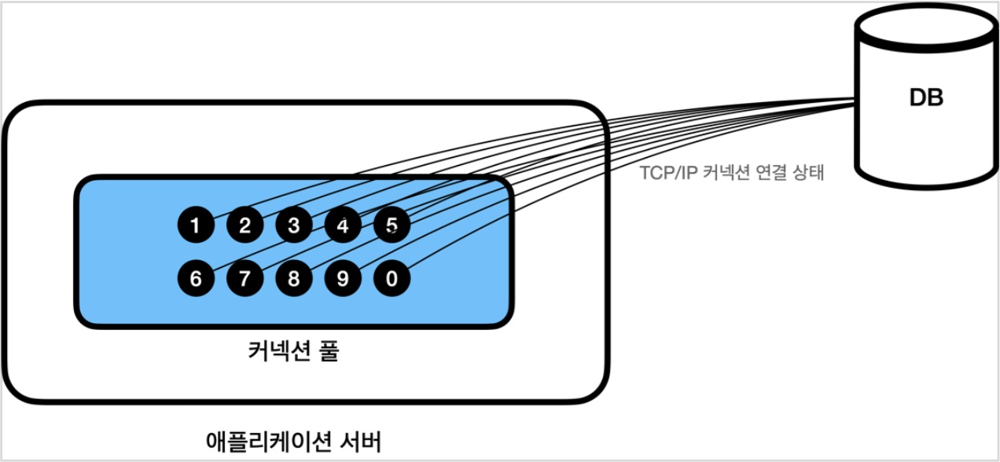
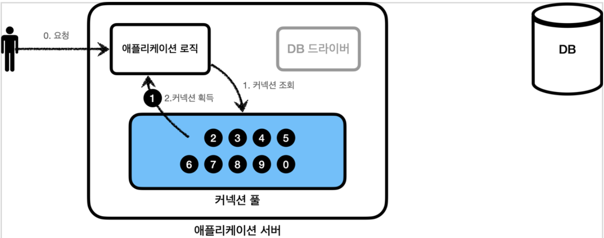
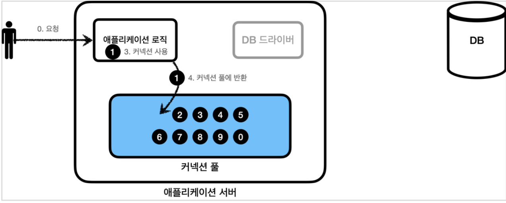
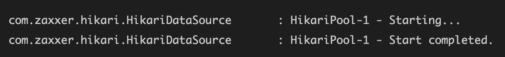

# 데이터베이스 커넥션 풀(DBCP)
사용자로 부터 요청이 올때마다 데이터베이스와 연결하고 해재하는것은 굉장히 비효율적이다.
미리 여러개의 데이터베이스 커넥션을 생성해놓고, 필요할 때마다 꺼내서 사용하면 더 좋지 않을까?

## 커넥션 풀(Connection Pool)이란?
WAS는 데이터베이스 커넥션이 필요할 때 직접 생성해서 사용하지 않고 커넥션 풀 컨테이너를 사용해서 미리 커넥션을 생성해놓고, 필요할 때마다 하나를 사용하고 다 사용하면 다시 커넥션 풀 컨테이너에 반납을 한다.

커넥션 풀을 간단히 말하자면 수영장(수영장 풀을 상상하면 된다)이다.

### 초기화

애플리케이션을 처음 실행하는 시점에 커넥션 풀에 커넥션을 미리 생성해놓는다.
보통 10개를 처음에 생성한다.
### 연결 상태

커넥션 풀은 DB와 TCP/IP로 항상 연결되어 있는 상태이니 언제든지 즉시 SQL을 DB에 전달할 수 있다.

### 사용

+ 애플리케이션에서는 이제 DB드라이버로 새로운 커넥션을 생성하는것이 아니다.
+ 커넥션 풀에서 이미 만들어놓은 커넥션을 요청해서 커넥션을 획득한다.

### 반환

+ 애플리케이션 로직은 획득한 커넥션을 사용해서 SQL을 DB로 그 데이터값을 처리한다.
+ 커넥션을 다 사용하면 커넥션풀로 다시 반환한다.
+ 커넥션을 종료시키는 것이 아닌 살아있는 상태로 풀로 반환만 한다.

### HikariCP
데이터베이스 커넥션 풀 프레임워크로 가장 많이 사용되는 것은 `HikariCP`이다.  스프링부트2.0부터는 기본적으로 `Hikaricp`를 사용한다.

스프링부트로 개발을 해본 사람이라면, HikariCP가 무엇인지 이름은 들어봤을 것이다. 스프링부트로 만든 애플리케이션을 기동하면 아래와 같은 로그가 출력되기 때문이다.

HikariCP는 스프링부트에 기본적으로 내장되어 있는 JDBC 데이터베이스 커넥션 풀링 프레임워크이다. 스프링부트는 HikariCP를 사용할 수 있는 상황에서는 항상 HikariCP를 사용한다. 제일 성능이 좋기 때문이다.
### 장점
1. 서버의 부하를 줄여준다.
> 웹 어플리케이션에서 커넥션풀을 사용하는 가장 큰 이유는 java에서 DB Connection을 맺는 과정이 부화가 가장 많이 걸리는 작업이어서 동시에 많은 사람이 DB Connection을 맺으면 서버가 터질수도 있다. 이러한 문제를 해결하고자 커넥션풀을 사용해서 connection을 미리 생성하고 재활용하면서 서버의 부하를 줄여준다.
2. 서버의 한정적인 자원을 효율적으로 사용할수 있다.
> 서버는 한정적인 용량을 가지고 있지만 요청이 올때마다 connection을 생성하게 되면 전체 시스템에 문제가 발생할 수 있다. 그렇기 때문에 커넥션풀에 이미 생성해놓은 connection을 관리한다.  

